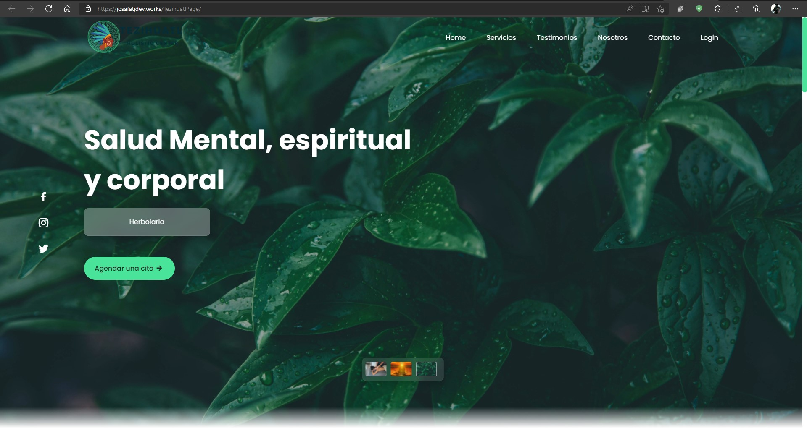

# Tezihuatl Holistic Center :hospital: - Proyecto Ingenieria de Software

Hola :hand:

Aqui te muestro mi proyecto de ingenieria de software, el cual consiste en una pagina web en la que se puedan agendar citas, ademas de mostrar un poco sobre lo que ofrece el centro.

Ademas de que contendra un admin dashboard en el cual se podran agregar todas las cosas que se necesiten, como citas, usuarios, etc. (en construcción)

## Diseño del website :framed_picture:

[Diseño UI](./Views/tezihuatl%20UI%20Definitiva.pdf)

## Admin Dashboard

:construction: En construccion :construction:

 
 

## Despliegue :rocket:

El sitio web se encuentra desplegado en dos hosting, uno en github pages con un dominio personal y otro en un servidor de hosting gratuito; se pueden apreciar a continuacion.

#### Despliegue en Github Pages

[Ver despliegue](josafatjdev.works/TezihuatlPage)

#### Despliegue en Hosting

[Ver despliegue](http://www.tezihuatlcenter.ml/)

 

###### Made with :heart: by Josafat Jimenez :mexico:
